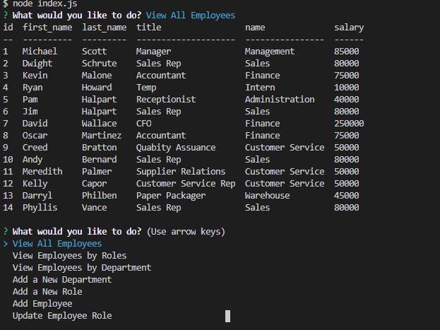

  # Employee Tracker 

  
  ## Description
  This is a employee management tool that uses MySQL, Inquirer, Node.js, and Console.Table. The application allows you to view your employees, their roles, their departments, and Salary by joining 3 tables and making queries to my MySQL database. You can also add employees and update employee's roles. 

  [Project Link](https://github.com/Jason-Jorgensen/Employee-Tracker)

  ## Table of Contents

  * [Installation](#installation)
  * [Usage](#usage)
  * [License](#license)
  * [Contributing](#contributing)
  * [Tests](#tests)
  * [Questions](#questions)

  ## Installation

  npm i

  ## Usage

  node index.js to start the application.

  ## License

  This project is licensed under the MIT license.

  ## Contributing
  nothing to contribute at this time.

  ## Questions
  If you have any questions please email me at jasoncjorgensen@gmail.com.

  Also, please see my [GitHub](https://github.com/Jason-Jorgensen)
